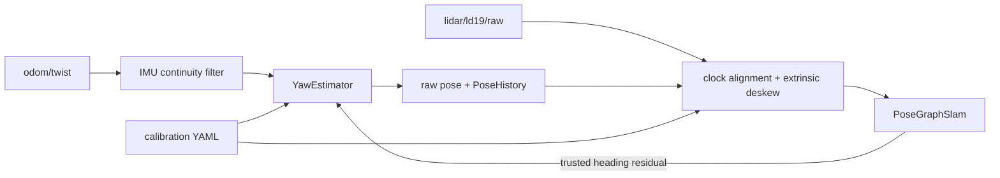

# Yaw Estimation and LiDAR Calibration Design

## Status

This design is implemented in the laptop-side SLAM stack. It does not require
a simulator flag, a new Zenoh topic, or a firmware change. The same estimator
and calibration consume the existing physical-robot and simulator messages.

The current system already has:

- quaternion continuity and implausible-yaw-jump rejection in `KiwiClient`;
- timestamped wheel twist and BNO08x Game Rotation Vector reports;
- LiDAR and odometry clock alignment;
- rolling-scan deskew with a manual time-offset parameter;
- line-aware scan matching and persistent LiDAR map-to-odometry correction.

Legacy startup-relative IMU yaw remains available through
`--yaw-estimator legacy`. The opt-in `fused` path, calibration recorder and
solver, planar extrinsic deskew, diagnostics, and deterministic tests described
below are implemented. Fused remains opt-in pending physical-robot replay.

## Goals

1. Keep the odometry yaw continuous through IMU resets and temporary sensor
   loss.
2. Fuse wheel and incremental IMU rotation without treating either as perfect.
3. Use trusted scan matches to learn slow session-local yaw-rate bias.
4. Calibrate wheel yaw scale, IMU yaw scale/bias, LiDAR time offset, and planar
   LiDAR translation from a reproducible raw dataset.
5. Preserve physical-robot compatibility and avoid Manhattan-world snapping.
6. Make every estimator decision and calibration result observable and
   testable.

## Non-goals

- Estimating magnetic north or a globally absolute heading.
- Adding a simulator-only ground-truth input to SLAM.
- Persisting an IMU bias across power cycles; BNO bias is session-dependent.
- Inferring LiDAR roll, pitch, or height from a planar scan. Those must be
  physically measured.
- Replacing the existing scan matcher or pose graph.

## Runtime architecture



`KiwiClient.ImuYawContinuityFilter` remains responsible only for quaternion
normalization and discontinuity repair. A new `YawEstimator` belongs in the
SLAM process because it needs scan-match feedback that generic robot clients
do not have.

## YawEstimator

### Module and API

Add `scripts/kiwi_yaw_estimator.py` with a transport-independent class:

```python
estimator = YawEstimator(config)

estimate = estimator.update_odometry(
    time_s=pose_time,
    wheel_omega_rad_s=measured_omega,
    imu_yaw_rad=continuous_imu_yaw,
    imu_valid=imu_ready,
    imu_discontinuity=imu_yaw_discontinuity,
    wheel_valid=bool(encoder_ready_mask),
    linear_speed_m_s=math.hypot(measured_vx, measured_vy),
)

estimator.observe_scan(
    time_s=scan_time,
    heading_disagreement_rad=result.heading_disagreement_rad,
    score=result.match_score,
    hit_ratio=result.hit_ratio,
    rmse_m=result.rmse_m,
    wall_support_ratio=result.wall_support_ratio,
    loop_closed=result.loop_closed,
    relocalized=result.loop_status.startswith("relocalized:"),
)
```

The returned estimate contains continuous yaw, fused yaw rate, uncertainty,
current learned bias, source weights, and the latest gating reason.

### Incremental fusion

For each odometry interval:

```text
wheel_delta = wheel_yaw_scale * wheel_omega * dt
imu_delta   = imu_yaw_scale * wrap(imu_yaw[k] - imu_yaw[k-1])
innovation  = wrap(imu_delta - wheel_delta)
fused_delta = wheel_delta + imu_weight * robust(innovation)
fused_delta = fused_delta - learned_rate_bias * dt
yaw         = wrap(yaw + fused_delta)
```

Uncalibrated fallback values:

- `imu_weight = 0.5` when both measurements are healthy; a calibration run
  replaces this with an inverse-variance weight measured against LiDAR yaw;
- `imu_weight = 0.0` for a rejected IMU discontinuity;
- `imu_weight = 1.0` when wheel odometry is unavailable;
- use wheel-only propagation when the IMU is unavailable;
- hold yaw and increase uncertainty when both sources are unavailable.

The innovation uses a Huber-style clamp, initially 3 degrees plus the
rotation expected during the interval. This prevents one report from rotating
the trajectory while allowing legitimate fast turns. The existing continuity
filter remains the first and stronger reset guard.

A robust complementary estimator is preferred over a full EKF initially. The
BNO08x Game Rotation Vector and wheel twist have correlated, motion-dependent
errors; assigning them precise Gaussian covariances would imply accuracy the
retained data does not support. The estimator still maintains a scalar yaw
uncertainty for gating and diagnostics.

### Scan-feedback bias learning

`heading_disagreement_rad` is the difference between the LiDAR-corrected yaw
and the startup-relative raw heading. Unwrap trusted observations in a rolling
5-15 second window and robustly fit:

```text
heading_disagreement(t) = intercept - yaw_rate_bias * t
```

The negative fitted slope is an observation of the raw estimator's yaw-rate
bias. Update `learned_rate_bias` with an exponential time constant of 30
seconds and clamp it to +/-0.3 degrees/second. Bias feedback changes only
future propagation; it never creates an instantaneous yaw jump. Immediate
pose correction remains the responsibility of `map_to_odom`.

Accept an observation only when all applicable gates pass:

- `scan_matched` is true;
- match score >= 0.90;
- hit ratio >= 0.75;
- RMSE <= 0.10 m;
- at least 25 percent of scan weight is supported by long lines, or another
  explicit geometry-quality test passes;
- the robot has remained nearly stationary: translation <= 0.03 m/s and
  rotation <= 15 degrees/s. Moving corridor corrections are not observable as
  constant rate bias and clear the feedback window;
- no loop closure, relocalization, session change, or rejected IMU jump is in
  progress;
- the observation window spans at least 3 seconds.

Clear the feedback window after loop optimization or relocalization so a
global graph correction cannot be mislearned as sensor bias. Freeze bias when
matches are rejected or geometry is weak.

The existing wall extractor should return diagnostics in addition to weights:
supported point ratio, total supported line length, and line orientations.
Those orientations are quality diagnostics only; they do not create a global
axis or Manhattan prior.

### Failure behavior

| Condition | Behavior |
|---|---|
| IMU discontinuity | Use wheel delta, freeze scan-bias update for one window |
| IMU missing | Wheel-only propagation, grow uncertainty faster |
| Encoders missing | Incremental IMU propagation, freeze wheel-scale learning |
| Both missing | Hold yaw; SLAM may still localize scans, but report degraded state |
| Scan rejected | Continue fused dead reckoning; do not update bias |
| Loop closure/relocalization | Keep runtime yaw continuous and reset feedback window |
| Resume saved map | Start a new estimator bias session and use normal SLAM relocalization |

## Planar LiDAR extrinsics

Add a body-from-LiDAR transform with parameters:

```text
lidar_x_m
lidar_y_m
lidar_yaw_deg
lidar_time_offset_ms
```

For a point acquired at time `t`, deskew into the body frame at the scan
reference time:

```text
p_body_ref = inverse(T_map_body(t_ref))
             * T_map_body(t + time_offset)
             * T_body_lidar
             * p_lidar
```

The current implementation is the special case where `T_body_lidar` is the
identity transform.

Planar rotation strongly observes LiDAR `x/y` translation. LiDAR yaw is only
weakly identifiable from an occupancy map because the map has an arbitrary
global orientation; measure mounting yaw physically and use calibration only
for a small residual refinement. Roll, pitch, and height are outside this 2D
solver.

## Calibration data

Add `scripts/kiwi_calibrate_slam.py` with `record`, `solve`, and `validate`
subcommands. Recording must not depend on Rerun persistence.

A calibration run directory uses `kiwi-calibration-log-v1`:

```text
run.json                 metadata, namespace, clocks, firmware status
odom.jsonl               arrival time plus complete odometry reports
lidar.bin                arrival_ns + payload_length + original LD19 bytes
events.jsonl             operator markers and commanded calibration phase
```

The original payloads are retained so parsing, clock alignment, deskew, and
estimation can be replayed through production code. Camera data is not needed
for this calibration.

## Calibration trajectory

Collect both clockwise and counter-clockwise motion to separate constant
offsets from directional error:

1. 10 seconds stationary for IMU noise and drift baseline.
2. Two slow 360-degree rotations in each direction near walls with corners.
3. Two faster 360-degree rotations in each direction.
4. Straight passes in both directions alongside a long wall.
5. A rectangular or full-house loop for held-out validation.

In simulation, the privileged actor may execute this trajectory, but the
solver sees only the recorded robot topics. On hardware, the same phases can
be manually driven and marked from the calibration command.

## Calibration solver

### Wheel and IMU rotation

Use trusted LiDAR scan-match yaw increments as the reference and robustly fit
over rotation segments:

```text
scan_delta_yaw = wheel_yaw_scale * integral(wheel_omega dt)
scan_delta_yaw = imu_yaw_scale * imu_delta_yaw - imu_rate_bias * dt
```

Fit clockwise and counter-clockwise segments jointly with a Huber loss. Bias
comes primarily from the stationary and unequal-duration portions; scale comes
from rotations. Reject segments with weak scan geometry or failed matches.

If desired, convert wheel yaw scale into a suggested drivetrain base radius:

```text
new_base_radius = old_base_radius * integrated_wheel_yaw / scan_yaw
```

The solver reports this command but does not provision the robot automatically.

### LiDAR time and translation

Build reference wall lines from stationary or very slow scans. For candidate
time offset and LiDAR `x/y`, deskew moving scans and minimize robust
point-to-reference-line distance across neighboring scans. Include both
rotation directions and multiple angular speeds; at one constant speed, time
offset and tangential sensor displacement are partially coupled.

Use bounded stages rather than one opaque global optimizer:

1. Grid-search time offset over +/-50 ms at 1 ms resolution.
2. Optimize LiDAR `x/y` within +/-0.15 m using robust least squares.
3. Jointly refine time and `x/y` around the best result.
4. Optionally refine mounting yaw within the physically measured uncertainty.
5. Evaluate the result on held-out passes that were not used for fitting.

Primary objective metrics are median and p90 wall residual, reconstructed wall
thickness, CW/CCW symmetry, and scan-match success rate. A calibration is
rejected if it improves the training trajectory but makes held-out wall
thickness or matching worse.

## Configuration file

Add optional `--calibration FILE` support to SLAM and the dashboard. CLI flags
override file values for experiments.

```yaml
format: kiwi-slam-calibration-v1
created_at: 2026-08-24T00:00:00Z
source_run: calibration/robot-20260824

yaw_estimator:
  wheel_yaw_scale: 1.0
  imu_yaw_scale: 1.0
  initial_rate_bias_deg_s: 0.0
  imu_weight: 0.5
  bias_time_constant_s: 30.0

lidar:
  time_offset_ms: 0.0
  x_m: 0.0
  y_m: 0.0
  yaw_deg: 0.0

validation:
  wall_residual_median_m: null
  wall_residual_p90_m: null
  rotation_error_p95_deg: null
```

Static scale and extrinsic values persist. The online learned rate bias is
session-local and starts from the configured initial value, normally zero.
Save calibration provenance and validation metrics so an old or poor result is
not silently treated as truth.

## Diagnostics

Extend the SLAM pose payload and Rerun dashboard with optional fields:

- fused yaw and yaw rate;
- wheel and IMU deltas;
- wheel/IMU blend weight;
- learned rate bias in degrees/second;
- yaw uncertainty;
- scan-feedback accepted/rejected and reason;
- wall support ratio and supported line length;
- active calibration file and format version.

Saved graph JSON should retain the static calibration and aggregate estimator
diagnostics. Raw calibration logs remain separate from normal map artifacts.

## Tests and acceptance criteria

### Unit tests

- wrap-safe wheel/IMU fusion through +/-pi;
- constant IMU drift with convergence of learned rate bias;
- wheel slip without an estimator discontinuity;
- IMU reset rejected by the continuity filter and wheel fallback;
- missing IMU, missing encoders, and both missing;
- scan-feedback gates, loop reset, relocalization reset, and session reset;
- nonzero LiDAR `x/y/yaw` deskew geometry;
- time offset and extrinsic parameter bounds.

### Synthetic calibration tests

- recover an injected 10 ms time offset within 2 ms;
- recover injected planar LiDAR translation within 1 cm;
- recover wheel yaw scale within 0.5 percent;
- recover a 0.05 degree/second yaw-rate bias within 0.01 degree/second;
- improve held-out p90 wall residual by at least 20 percent when the baseline
  is intentionally miscalibrated.

### End-to-end simulation

- rotation-regression final yaw error <= 1.5 degrees;
- full-house raw heading disagreement p95 <= 2.5 degrees after bias warmup;
- no more than a two percentage-point reduction in scan-match success;
- no regression in loop completion or occupancy-map wall thickness;
- identical behavior through browser and headless Zenoh simulators.

### Physical robot

The first physical dataset establishes the final thresholds. Compare legacy
and fused estimators by replaying the exact same raw calibration recording.
Do not make the new estimator the default until held-out wall thickness,
heading disagreement, and scan success all improve or remain neutral.

## Implementation phases

1. **Implemented — instrumentation and replay:** raw calibration recorder, wall diagnostics,
   estimator diagnostics, and deterministic replay.
2. **Implemented — estimator:** `YawEstimator`, legacy/fused runtime switch, unit tests, and
   simulated drift/slip cases.
3. **Implemented — extrinsic deskew:** planar transform support in production deskew plus
   browser/headless simulator parity.
4. **Implemented — solver:** segment-based rotation scale/bias fit, time-offset grid, planar translation
   refinement, held-out validation, and calibration YAML.
5. **Pending hardware — robot validation:** record the prescribed trajectory, solve once, replay
   A/B, then deliberately promote the fused estimator to the default.

Until phase 5, retain `--yaw-estimator legacy|fused` and make map artifacts
record which estimator and calibration were used.
